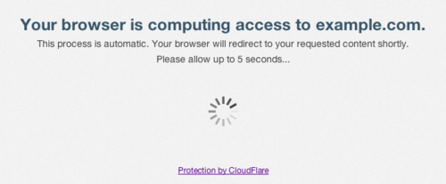

# Anonymous
# <b>Anonymous</b> 
<h2>Http Unbearable Load King 👑</h2> 

#
## <b>DDOS Attack Script :</b>

#
## <b>Git Installation :</b>
`sudo apt update && sudo apt upgrade -y` 
`sudo apt install python -y` 
`sudo apt install git -y` 
`python -m pip install -r requirements.txt` 
`python anonymous.py` 
#
<h2> <strong>What is DDOS Attack?</strong> </h2>  
<h3> DDoS (Distributed Denial of Service) is a category of malicious cyber-attacks that hackers or cybercriminals employ in order to make an online service, network resource or host machine unavailable to its intended users on the Internet. Targets of DDoS attacks are flooded with thousands or millions of superfluous requests, overwhelming the machine and its supporting resources. DDoS attacks are distinct from conventional Denial of Service incidents in that they originate from distributed or multiple sources or IP addresses. To get a sense of the enormous scope of the DDoS threat, the Check Point ThreatCloud Live Cyber Threat Map provides a global window into malware activity, providing a DDoS attacks map where exploits can be viewed in real time.</h3> 

  

